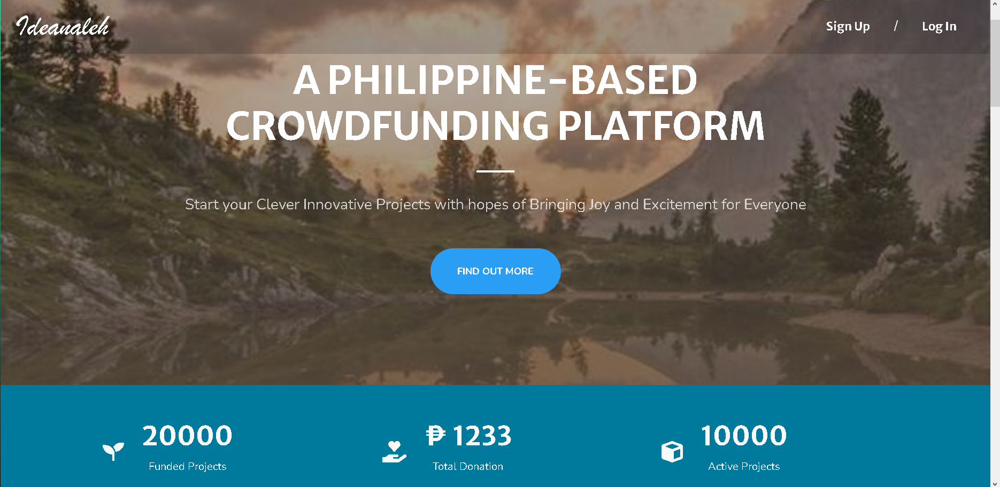
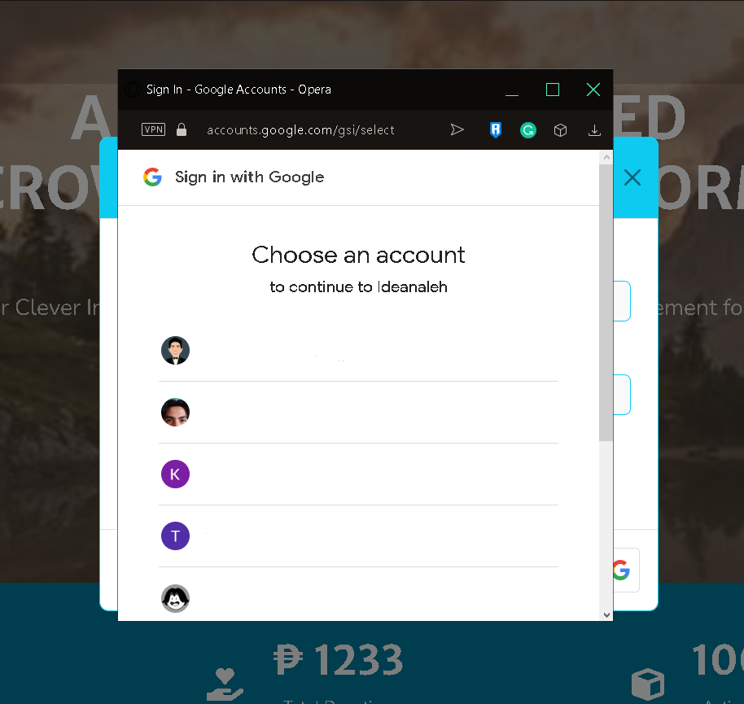
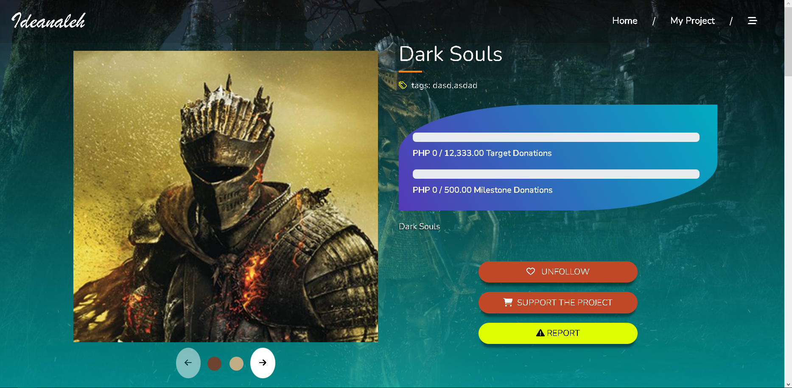
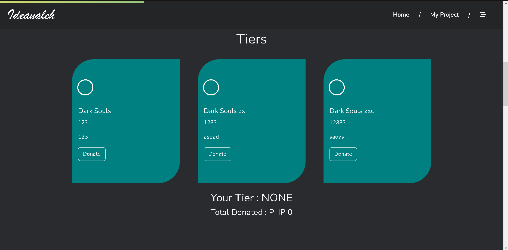
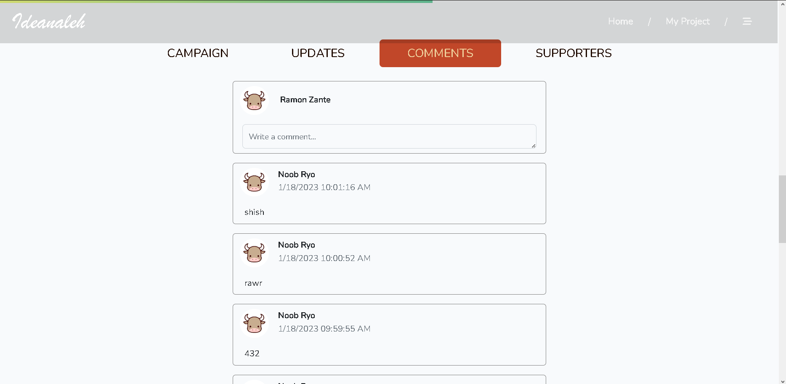
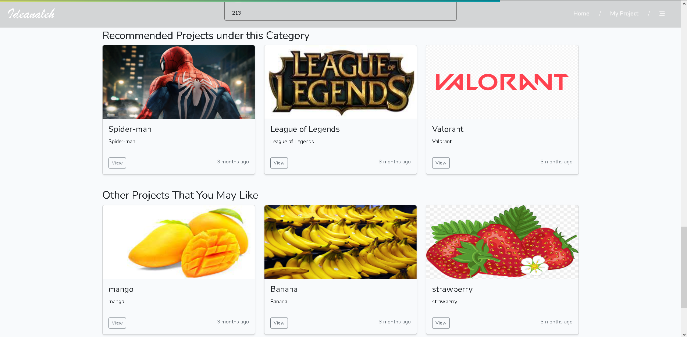
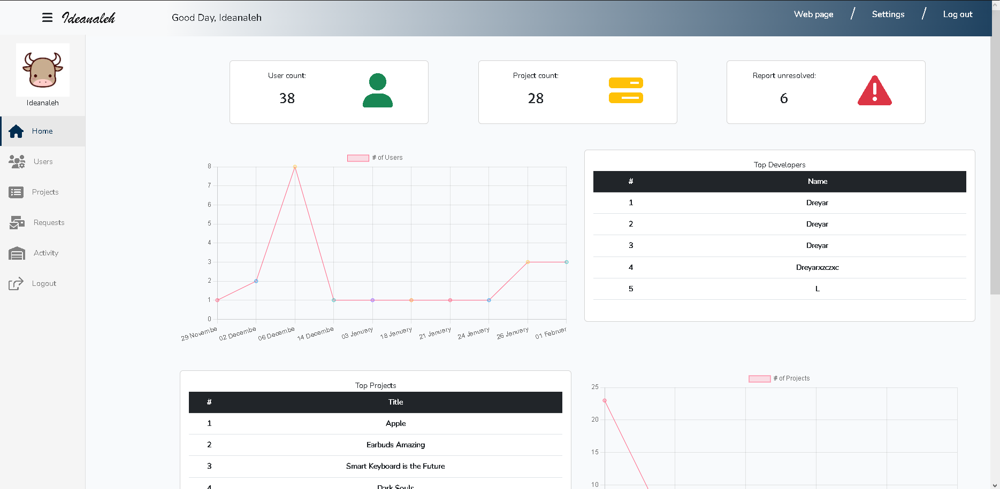

# Ideanaleh
Ideanaleh is a reward-based crowdfunding web application built on the Laravel framework and SQL database. The platform allows creators to showcase their ideas and receive support from backers in the form of monetary contributions. The application features an intuitive user interface that makes it easy for creators to set up campaigns, and for backers to browse and contribute to projects that align with their interests. In addition to standard crowdfunding features, Ideanaleh also integrates with Google Login for easy account creation and login, and offers YouTube embeds to allow creators to showcase their videos and build excitement for their campaigns. With Ideanaleh, creators can bring their ideas to life with the support of a community of passionate backers.

# Functionality

- **Google Authentication** - Google account's can be used for seamless and hassle-free signup.

    

- **Project Creation** - Users can create project pages to promote their works and offer rewards to supporters.

    

    - Project creators can have up to 3 reward tiers.
    

- **Real-time Comments** - Comments are delivered to users in real-time using websockets.

    

- **Recommendation System** - Other projects are recommended through the use of the apriori algorithm with collaborative filtering.

    

- **Administrative Systems** - Admins have statiscal views and control over users and project reports.

    

# Requirements
- [Laravel](https://laravel.com)
- [Google Authentication](https://developers.google.com/identity/sign-in/web/sign-in)
- [XAMPP](https://www.apachefriends.org)
- [PayPal Developer Credentials](https://developer.paypal.com/home/)
- Email and it's Password for the ENV file

# Installation

1. Clone this repository
2. Run the commands:
####
    composer install
    npm install
####
3. Setup the ENV file

- Set the datbase name and database username and or password from XAMPP
#### Sample
    DB_CONNECTION=mysql
    DB_HOST=127.0.0.1
    DB_PORT=3306
    DB_DATABASE=ideanaleh
    DB_USERNAME=root
    DB_PASSWORD=
 

- Run the commands:
####
    php arisan migrate
    php artisan storage:link
 

- Add the email and it's password, Google Auth and PayPal developer credentials to the ENV fileto the ENV file.
#### Sample
    MAIL_MAILER=smtp
    MAIL_HOST=smtp.googlemail.com
    MAIL_PORT=465
    MAIL_USERNAME=<EMAIL_ADDRESS_HERE>
    MAIL_PASSWORD=<EMAIL_PASSWORD_HERE>
    MAIL_ENCRYPTION=tls
    MAIL_FROM_ADDRESS="<EMAIL_ADDRESS_HERE>"
    MAIL_FROM_NAME="Ideanaleh"

    GOOGLE_CLIENT_ID =  '<GOOGLE_AUTH_CLIENT_ID_HERE>'
    GOOGLE_CLIENT_SECRET = '<GOOGLE_AUTH_SECRET_ID_HERE>'
    GOOGLE_REDIRECT = 'http://127.0.0.1:8000/google/callback'

    PAYPAL_CLIENT_ID=<PAYPAL_DEV_CLIENT_ID_HERE>
    PAYPAL_CLIENT_SECRET=<PAYPAL_SECRET_ID_HERE>
    PAYPAL_CURRENCY=PHP

# Usage
1. Run your XAMPP control panel.
2. Open a terminal and run the command:
####
    npm run dev
3. Open another terminal and run the command:
####
    php artisan serve
4. Open a new terminal and run the command:
####
    php artisan websockets:serve
5. Access the website through the configured port in XAMPP
#### Sample
    http://localhost:8000/

# License
Ideanaleh is licensed under [GPLv3](https://www.gnu.org/licenses/gpl-3.0.en.html)
